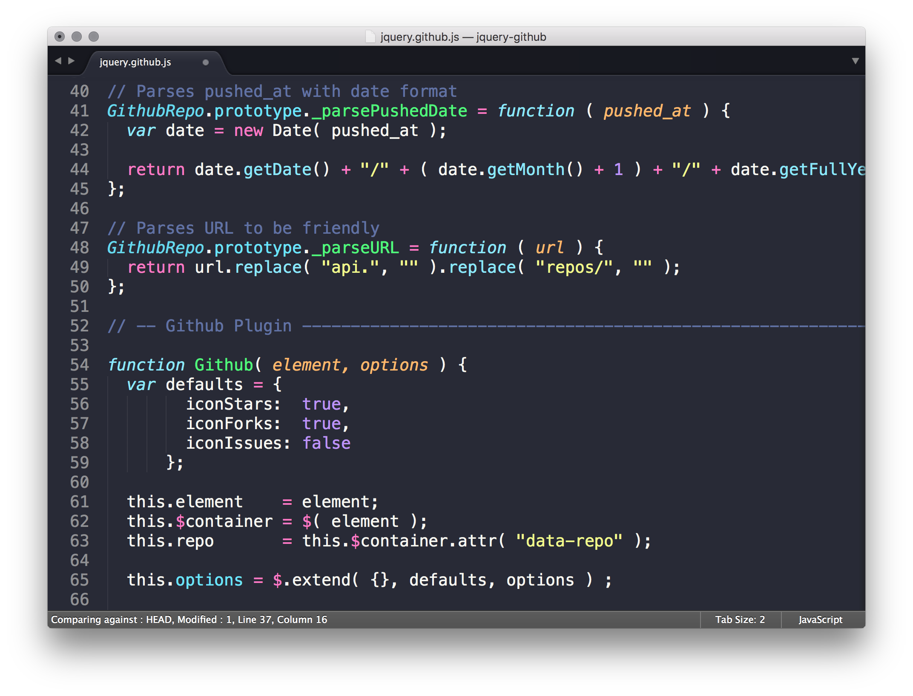

# Dracula for [Armorpaint](https://armorpaint.org/)

> A dark theme for [Armorpaint](https://armorpaint.org/).

## Install

All instructions can be found at [draculatheme.com/x](https://draculatheme.com/x).

## Team

This theme is maintained by the following person(s) and a bunch of [awesome contributors](https://github.com/dracula/template/graphs/contributors).

 |
--- |
[Low Polygon Design]() |

## License

[MIT License](./LICENSE)
